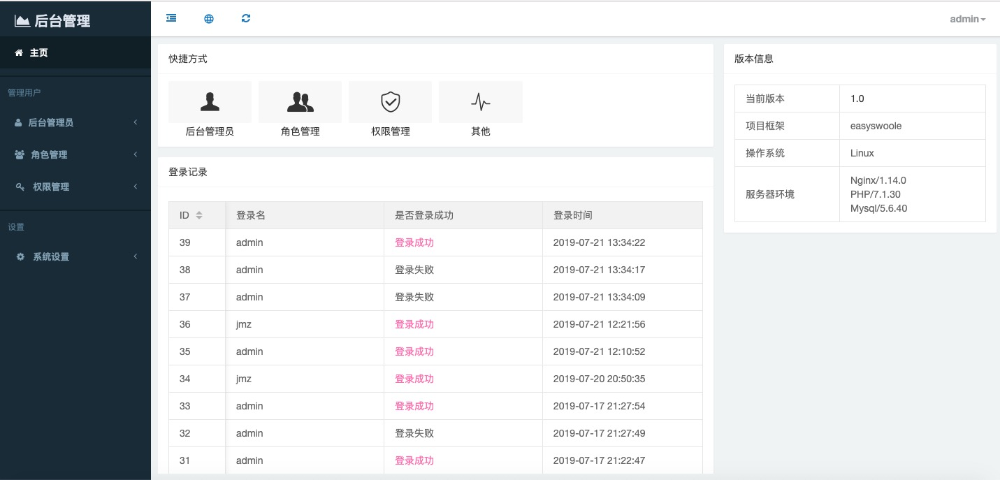
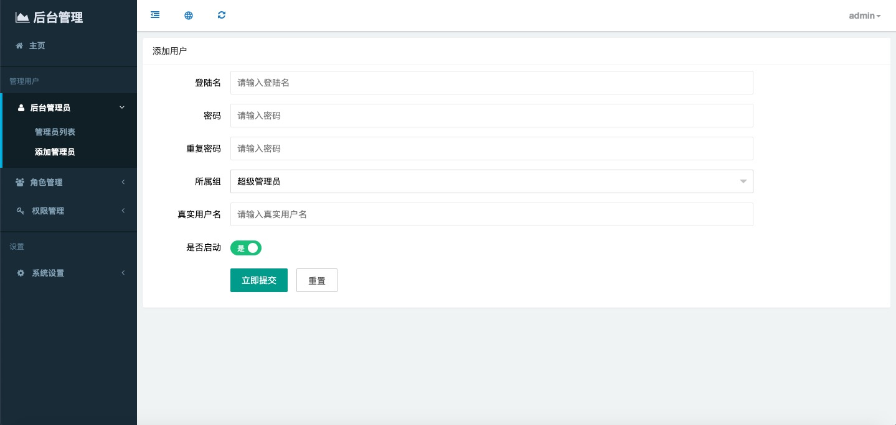
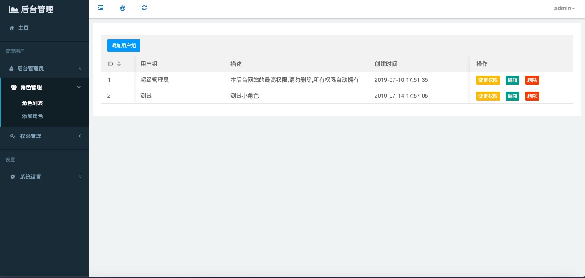
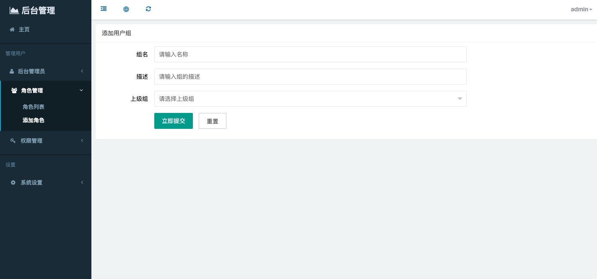
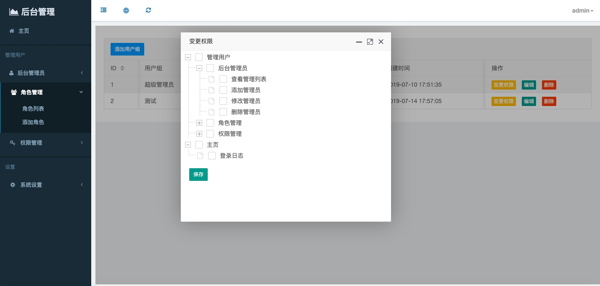
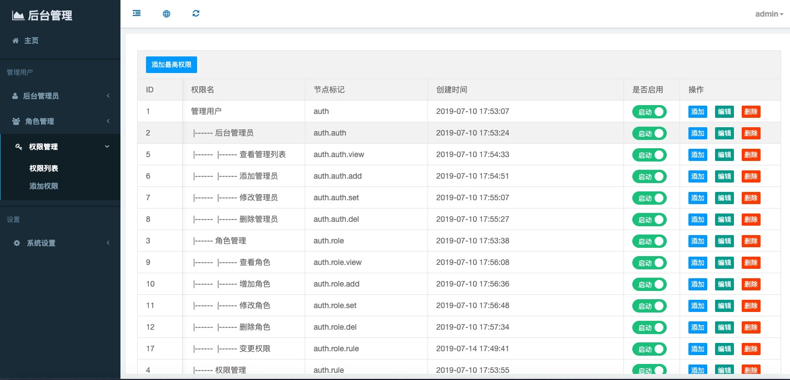
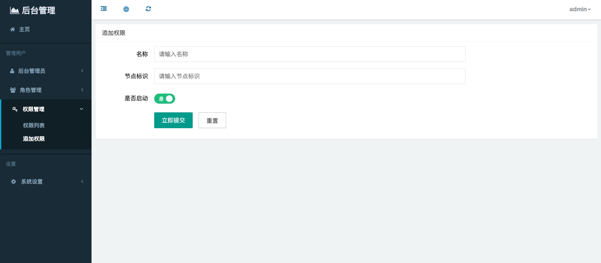

基于 easyswoole 二次开发
====

#### 一、后台展示
* 1.1 主页


* 1.2 管理员列表页面


* 1.3 添加管理员


* 1.4 角色管理页面


* 1.5 添加用户组


* 1.6 变更权限


* 1.7 权限管理


* 1.8 添加权限



#### 二、目录介绍
```
App
  |- Base                     // 基础类文件
      |- AdminController.php    // 后台admin 基础controller 类  继承了BaseCcontroller
      |- BaseController.php     // 最基础的 controller 类
      |- BaseModel.php          // 最基础的model 类
  |- Config                   // 关于App 项目的配置
  |- Common                   // 公共函数
  |- HttpController           // 控制器类文件夹
      |- Router.php             // 路由文件
      |- Web                    // web模块
          |- Idea.php           // 意见反馈类文件
          |- VeidyCode.php      // 验证码类
  |- Model
      |-AdminAuth.php                // auth model 类 继承了BaseModel
  |- Process                  // 和进程有关的文件都存于此处
      |- HotReload.php          // 热更新 程序
  |- Static                   // 静态资源文件
  |- Utility                  // 公共组件
      |- Log                    // 日志组件
      |- Message                // 消息 组件
      |- Pool                   // 进程 组件 （mysql池，redis池）
      |- Template               // 模板类文件夹
  |- Views                    // 模板
```


#### 三、环境
```
php >= 7.1 
swoole-4.3 
[composer 下载安装](https://www.cnblogs.com/xiaobaiskill/p/11003514.html)
```


#### 四、安装
```
* composer config -g repo.packagist composer https://packagist.laravel-china.org

* composer install
// 无法下载 可忽略版本 composer install --ignore-platform-reqs


* cp vendor/easyswoole/easyswoole/bin/easyswoole easyswoole

* cp dev.php produce.php
// 修改produce.php 中的DEBUG => false

* 执行 sql.sql

```


#### 五、设置
* 5.1 nginx 配置
```
location / {
      rewrite ^/(.*)$ /admin/$1 break;
      proxy_pass  http://127.0.0.1:9503;
      proxy_redirect     off;
      proxy_set_header   Host             $host;
      proxy_set_header   X-Real-IP        $remote_addr;
      proxy_set_header   X-Forwarded-For  $proxy_add_x_forwarded_for;
  }
location ~ .*\.(gif|jpg|jpeg|png|bmp|swf|woff2|woff|ttf|ico)$
{
    root /path/to/App/Static;  // 写这个项目静态文件夹的绝对地址
    expires      30d;
}
location ~ .*\.(js|css|map)?$
{
    root /path/to/App/Static; // 写这个项目静态文件夹的绝对地址
    expires      12h;
}

```
* 5.2 db 配置文件
```
在App/Config 目录下添加文件 Database.php

<?php
return [
    'MYSQL' => [
        //数据库配置
       'host'                 => '127.0.0.1',//数据库连接ip
       'user'                 => 'vagrant',//数据库用户名
       'password'             => 'vagrant',//数据库密码
       'database'             => 'test',//数据库
       'port'                 => '3306',//端口
       'timeout'              => '30',//超时时间
       'connect_timeout'      => '5',//连接超时时间
       'charset'              => 'utf8',//字符编码
       'strict_type'          => false, //开启严格模式，返回的字段将自动转为数字类型
       'fetch_mode'           => false,//开启fetch模式, 可与pdo一样使用fetch/fetchAll逐行或获取全部结果集(4.0版本以上)
       'alias'                => '',//子查询别名
       'isSubQuery'           => false,//是否为子查询
       'max_reconnect_times ' => '3',//最大重连次数
    ],
];

?>
```

#### 六、启动
```
// 测试环境启动
* php easyswoole start d   // 守护模式启动   默认加载 dev.php 文件


// 正式环境启动
php easyswoole start  produce d   // 加载produce.php 文件
```

#### 七、规范

* 类名
`大驼峰 （如： IndexController  BaseModel）`

* 方法/函数
`小驼峰 （如 getAll getOne）`

* 变量
`下划线 (如： $pwd_hash $user_info)`

#### 八、其他
```
[cache](https://packagist.org/packages/easyswoole/cache)

```